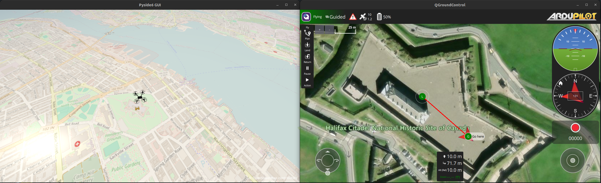

# ros2_pyside6_gui

__*WIP*__

Can run the ros main loop along with example pyside6 gui app OSMBuildings.

# References

[Pyside OSMBuildings Example](https://github.com/qtproject/pyside-pyside-setup/tree/dev/examples/demos/osmbuildings)

[Quadcopter 3D Model](https://free3d.com/3d-model/simple-quadcopter-916064.html)